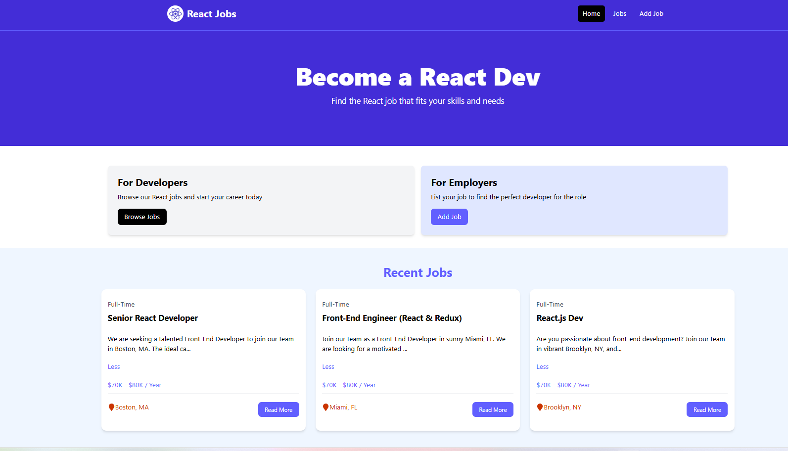

# React Jobs Project
This is the jobs listing project from youtube crash course

# Usage
This project uses JSON-Server for a mock backend.

## Install Dependencies
-npm install

## Run JSON Server
-The server will run on http://localhost:8000
-npm run server

## Run Vite Frontend
-React will run on http://localhost:3000
-npm run dev